← [Back to Main README](../README.md)


# Lab 01 — Employee Onboarding (JOINER Phase)

**Author:** Edward E. Spence
**Organization:** Fairmount Manufacturing LLC
**Lab:** IAMPAM.LAB
**Version:** 1.5
**Status:** ✅ Complete

---

## ⚠️ Simulation Notice

This lab simulates an enterprise Identity and Access Management onboarding workflow. All users, ticket numbers, and organizational data are fictional and created for demonstration purposes. The infrastructure used to execute the workflow is real and includes Active Directory, Microsoft Entra ID, HashiCorp Vault, Delinea Secret Server, Splunk SIEM, and AWS SAML federation.

---

## 🎯 Business Scenario

**Organization:** Fairmount Manufacturing LLC
**Industry:** Aerospace Components Manufacturing
**Compliance Context:** CMMC Level 2
**Ticket:** REQ0042001
**Request Type:** New Employee Onboarding — Bulk Provisioning

Provision 10 employees across Engineering, Finance, and IT/Security with:

- Active Directory accounts
- Entra ID synchronization
- Vault access policies
- Delinea PAM access
- Splunk audit visibility
- AWS federated access

---

## ✅ Pre-Checks (WITH VERIFICATION)

Run or validate the following before execution:

```powershell
# 1. Domain connectivity to DC01 (LDAP)
Test-NetConnection -ComputerName 172.31.100.10 -Port 389

# 2. Required AD groups exist
Get-ADGroup -Filter * | Where-Object {
    $_.Name -in @(
        "ENG-Users",
        "FIN-Users",
        "FIN-Approvers",
        "FIN-Auditors",
        "IT-Admins",
        "SEC-Analysts",
        "AAD-Sync-Users"
    )
} | Select-Object Name

# 3. Entra Connect delta sync from ID-SYNC01
Invoke-Command -ComputerName ID-SYNC01 -ScriptBlock {
    Import-Module ADSync
    Start-ADSyncSyncCycle -PolicyType Delta
}

# 4. Splunk receiver connectivity
Test-NetConnection -ComputerName 172.31.100.60 -Port 9997

# 5. Vault status
vault status

# 6. Delinea web reachability
Invoke-WebRequest -Uri "https://delinea01.iampam.lab/SecretServer" -UseBasicParsing

# 7. AWS federation check is performed interactively after Entra sync
```

---

## 👥 Onboarding Scope

| Display Name | SAM Account | UPN | Group |
|---|---|---|---|
| FM - Kira Vanthorpe | fm.kira.vanthorpe | fm.kira.vanthorpe@fairmontmanufacturing.onmicrosoft.com | ENG-Users |
| FM - Dalen Wescroft | fm.dalen.wescroft | fm.dalen.wescroft@fairmontmanufacturing.onmicrosoft.com | ENG-Users |
| FM - Mira Ashbridge | fm.mira.ashbridge | fm.mira.ashbridge@fairmontmanufacturing.onmicrosoft.com | ENG-Users |
| FM - Torin Calloway | fm.torin.calloway | fm.torin.calloway@fairmontmanufacturing.onmicrosoft.com | ENG-Users |
| FM - Brenli Harwick | fm.brenli.harwick | fm.brenli.harwick@fairmontmanufacturing.onmicrosoft.com | FIN-Users |
| FM - Casen Morrow | fm.casen.morrow | fm.casen.morrow@fairmontmanufacturing.onmicrosoft.com | FIN-Users |
| FM - Lyris Dunvale | fm.lyris.dunvale | fm.lyris.dunvale@fairmontmanufacturing.onmicrosoft.com | FIN-Approvers |
| FM - Orin Tressler | fm.orin.tressler | fm.orin.tressler@fairmontmanufacturing.onmicrosoft.com | FIN-Auditors |
| FM - Seren Holwick | fm.seren.holwick | fm.seren.holwick@fairmontmanufacturing.onmicrosoft.com | IT-Admins |
| FM - Zael Cortbridge | fm.zael.cortbridge | fm.zael.cortbridge@fairmontmanufacturing.onmicrosoft.com | SEC-Analysts |

---

## 🏗️ Architecture Flow

```text
User → Active Directory → AAD-Sync-Users → Entra ID → Vault / Delinea → Controlled Access → Splunk Audit
```

---

## 🟣 Phase 1 — Active Directory Provisioning

Bulk provisioning was performed with PowerShell and error handling rather than manual one-by-one creation. This ensures failed users do not stop the batch and that each result is logged for remediation. Each user is also added to `AAD-Sync-Users` to scope them for Entra ID synchronization.

```powershell
$users = @(
    @{Name="FM - Kira Vanthorpe";  SAM="fm.kira.vanthorpe";  UPN="fm.kira.vanthorpe@fairmontmanufacturing.onmicrosoft.com";  Group="ENG-Users"},
    @{Name="FM - Dalen Wescroft";  SAM="fm.dalen.wescroft";  UPN="fm.dalen.wescroft@fairmontmanufacturing.onmicrosoft.com";  Group="ENG-Users"},
    @{Name="FM - Mira Ashbridge";  SAM="fm.mira.ashbridge";  UPN="fm.mira.ashbridge@fairmontmanufacturing.onmicrosoft.com";  Group="ENG-Users"},
    @{Name="FM - Torin Calloway";  SAM="fm.torin.calloway";  UPN="fm.torin.calloway@fairmontmanufacturing.onmicrosoft.com";  Group="ENG-Users"},
    @{Name="FM - Brenli Harwick";  SAM="fm.brenli.harwick";  UPN="fm.brenli.harwick@fairmontmanufacturing.onmicrosoft.com";  Group="FIN-Users"},
    @{Name="FM - Casen Morrow";    SAM="fm.casen.morrow";    UPN="fm.casen.morrow@fairmontmanufacturing.onmicrosoft.com";    Group="FIN-Users"},
    @{Name="FM - Lyris Dunvale";   SAM="fm.lyris.dunvale";   UPN="fm.lyris.dunvale@fairmontmanufacturing.onmicrosoft.com";   Group="FIN-Approvers"},
    @{Name="FM - Orin Tressler";   SAM="fm.orin.tressler";   UPN="fm.orin.tressler@fairmontmanufacturing.onmicrosoft.com";   Group="FIN-Auditors"},
    @{Name="FM - Seren Holwick";   SAM="fm.seren.holwick";   UPN="fm.seren.holwick@fairmontmanufacturing.onmicrosoft.com";   Group="IT-Admins"},
    @{Name="FM - Zael Cortbridge"; SAM="fm.zael.cortbridge"; UPN="fm.zael.cortbridge@fairmontmanufacturing.onmicrosoft.com"; Group="SEC-Analysts"}
)

$OU = "OU=IAM-PAM-Users,DC=iampam,DC=lab"
$Password = ConvertTo-SecureString "Welcome@Fairmount2026!" -AsPlainText -Force
$Results = @()

foreach ($user in $users) {
    $result = [PSCustomObject]@{
        SAM         = $user.SAM
        Group       = $user.Group
        UserCreated = $false
        GroupAdded  = $false
        SyncScoped  = $false
        Error       = ""
    }

    try {
        New-ADUser `
            -Name $user.Name `
            -SamAccountName $user.SAM `
            -UserPrincipalName $user.UPN `
            -Path $OU `
            -AccountPassword $Password `
            -Enabled $true `
            -ChangePasswordAtLogon $true `
            -ErrorAction Stop

        $result.UserCreated = $true
    }
    catch {
        $result.Error = "User creation failed: $_"
    }

    if ($result.UserCreated) {
        try {
            Add-ADGroupMember -Identity $user.Group -Members $user.SAM -ErrorAction Stop
            $result.GroupAdded = $true
        }
        catch {
            $result.Error += " | Group assignment failed: $_"
        }

        try {
            Add-ADGroupMember -Identity "AAD-Sync-Users" -Members $user.SAM -ErrorAction Stop
            $result.SyncScoped = $true
        }
        catch {
            $result.Error += " | Sync scope assignment failed: $_"
        }
    }

    $Results += $result
}

$Results | Format-Table -AutoSize
New-Item -ItemType Directory -Force -Path "C:\Logs" | Out-Null
$Results | Export-Csv -Path "C:\Logs\FM-Onboarding-REQ0042001.csv" -NoTypeInformation
Write-Host "Results exported to C:\Logs\FM-Onboarding-REQ0042001.csv" -ForegroundColor Cyan
```

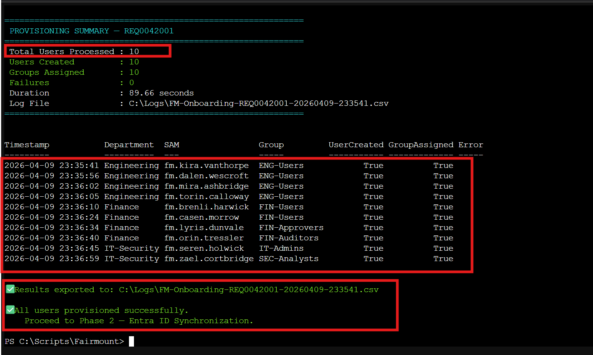

---

## 🟣 Phase 2 — Entra ID Synchronization

After users were created and added to `AAD-Sync-Users`, Entra Connect delta sync was triggered from ID-SYNC01.

```powershell
Invoke-Command -ComputerName ID-SYNC01 -ScriptBlock {
    Import-Module ADSync
    Start-ADSyncSyncCycle -PolicyType Delta
}
```

Validation included checking the Entra tenant for the synced Fairmount users.

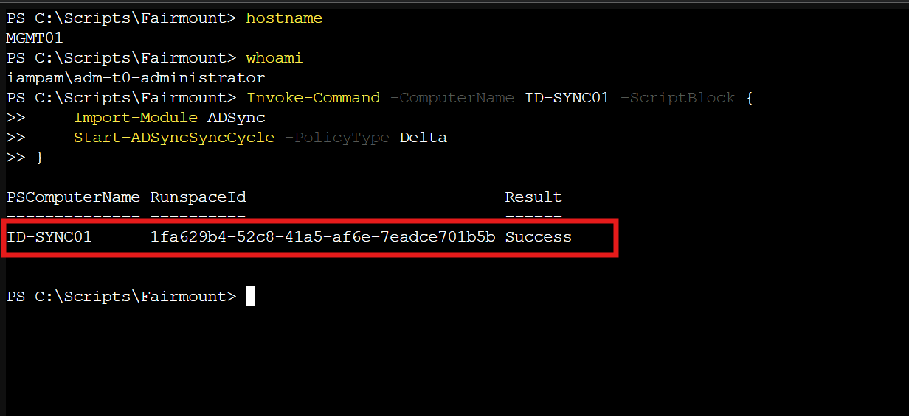
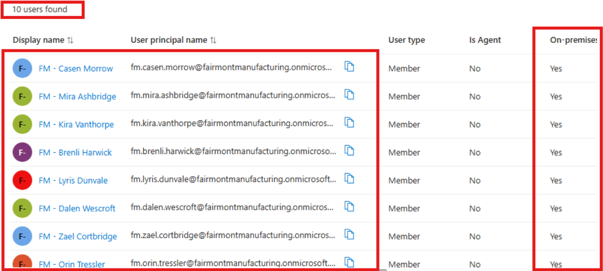

---

## 🟣 Phase 3 — AAD-Sync-Users Scope Control (CRITICAL)

`AAD-Sync-Users` is the architectural control group that determines which on-prem identities are eligible for synchronization into Entra ID. This is a core design decision in the lab and was explicitly validated during onboarding.

```powershell
Get-ADGroupMember -Identity "AAD-Sync-Users" | Select-Object Name, SamAccountName
```

This prevents unintended identities from syncing and gives the IAM team explicit control over cloud onboarding scope.

---

## 🟣 Phase 4 — Vault LDAP Integration

Vault was configured to authenticate against Active Directory through LDAP.

```bash
vault auth enable ldap

vault write auth/ldap/config \
    url="ldap://172.31.100.10" \
    userdn="OU=IAM-PAM-Users,DC=iampam,DC=lab" \
    groupdn="OU=IAM-PAM-Groups,DC=iampam,DC=lab" \
    binddn="CN=adm-t0-administrator,OU=Tier0,OU=PAM,DC=iampam,DC=lab" \
    bindpass="<adm-t0-administrator password>" \
    groupattr="member" \
    userattr="sAMAccountName"
```

⚠️ **Credential Security Note:**
Replace `<adm-t0-administrator password>` with the actual password at execution time.
Never store credentials in plain text in documentation or commit them to a repository.
In a production environment use a dedicated service account with least privilege bind permissions rather than an administrator account.

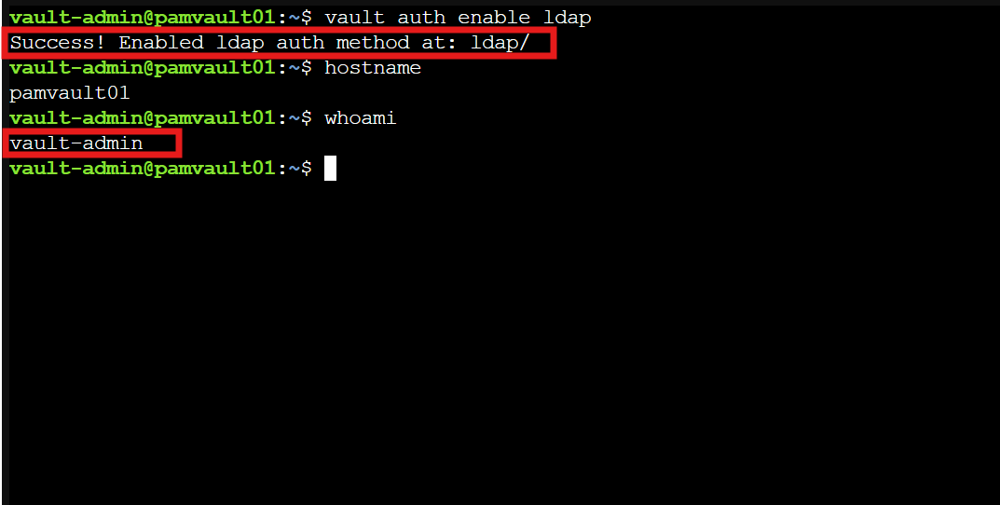
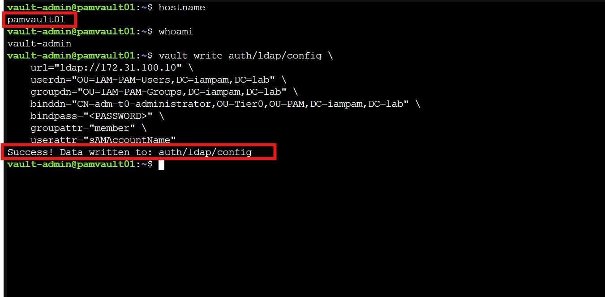

---

## 🟣 Phase 5 — Vault RBAC Mapping

Vault policies were created and mapped to AD groups to enforce least privilege.

Standard user policy:

```bash
vault policy write fairmount-users - <<EOF
path "secret/data/fairmount/*" {
  capabilities = ["read", "list"]
}
EOF
```

IT-Admins elevated policy:

```bash
vault policy write fairmount-it-admins - <<EOF
path "secret/data/fairmount/*" {
  capabilities = ["create", "read", "update", "delete", "list"]
}
EOF
```

AD group to policy mapping:

```bash
vault write auth/ldap/groups/IT-Admins    policies=fairmount-it-admins
vault write auth/ldap/groups/ENG-Users    policies=fairmount-users
vault write auth/ldap/groups/FIN-Users    policies=fairmount-users
vault write auth/ldap/groups/SEC-Analysts policies=fairmount-users
```

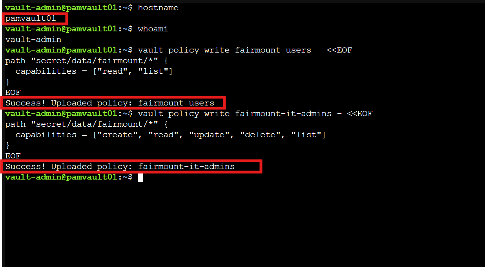
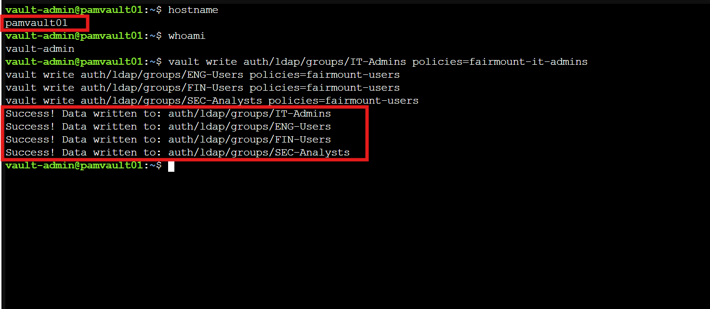

---

## 🟣 Phase 6 — Secret Management

Department-aligned service account credentials were stored as secrets.

```bash
vault kv put secret/fairmount/engineering \
    app_api_key="ENG-2026-FM-API-001" \
    shared_service_account="svc.eng.fairmount"

vault kv put secret/fairmount/finance \
    reporting_key="FIN-2026-FM-RPT-001" \
    audit_service_account="svc.fin.fairmount"

vault kv put secret/fairmount/it \
    admin_token="IT-2026-FM-ADM-001" \
    monitoring_key="svc.it.fairmount"
```

Validation included successfully reading expected secrets.

```bash
vault kv get secret/fairmount/engineering
vault kv get secret/fairmount/finance
vault kv get secret/fairmount/it
```

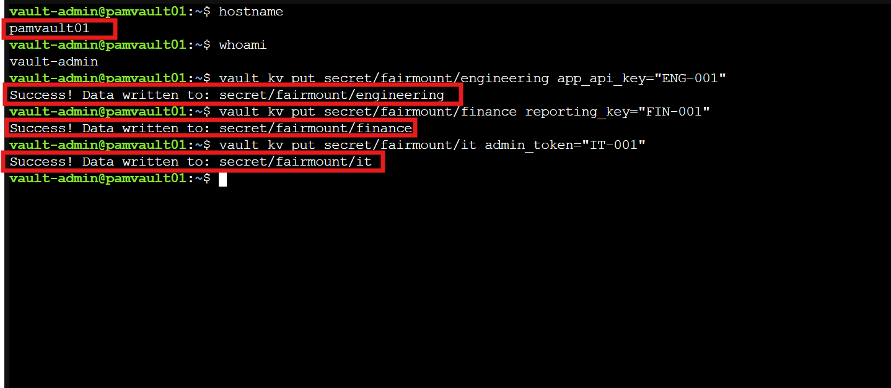
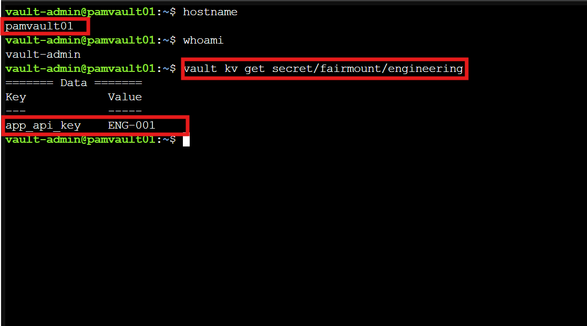

---

## 🟣 Phase 7 — Access Denial Validation

Least privilege was validated by attempting access outside of approved roles.

```bash
ssh fm.kira.vanthorpe@rhel01.iampam.lab
# Expected: Permission denied (publickey,gssapi-keyex,gssapi-with-mic,password)

vault kv get secret/fairmount/it
# Expected for non-IT users: permission denied
```

**Why this is expected:**
SSH on RHEL01 is restricted via `AllowGroups rhel-admins`. Fairmount standard users are not members of `rhel-admins` and cannot access privileged Linux systems. This confirms least privilege enforcement is working correctly. Only IT-Admins with the `fairmount-it-admins` policy can read the IT secret path.

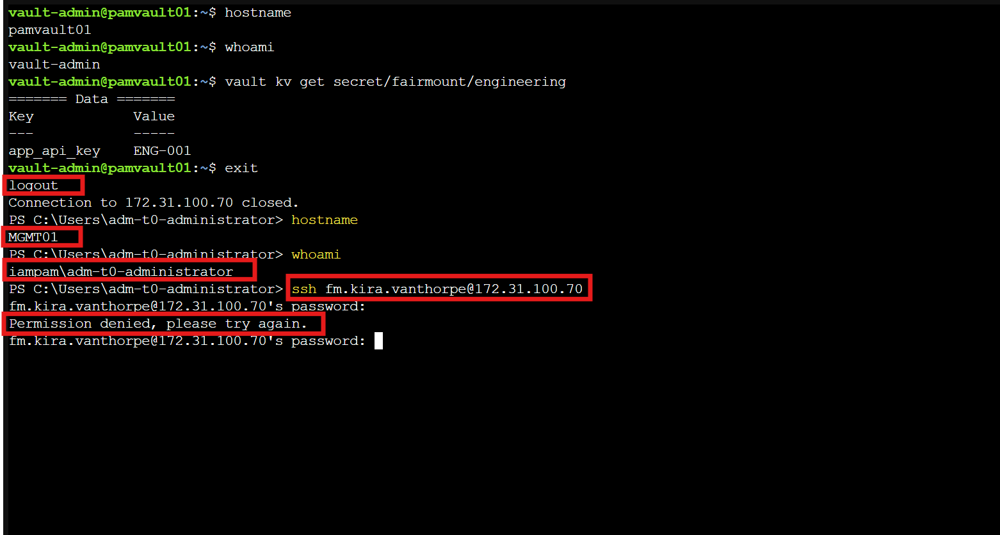
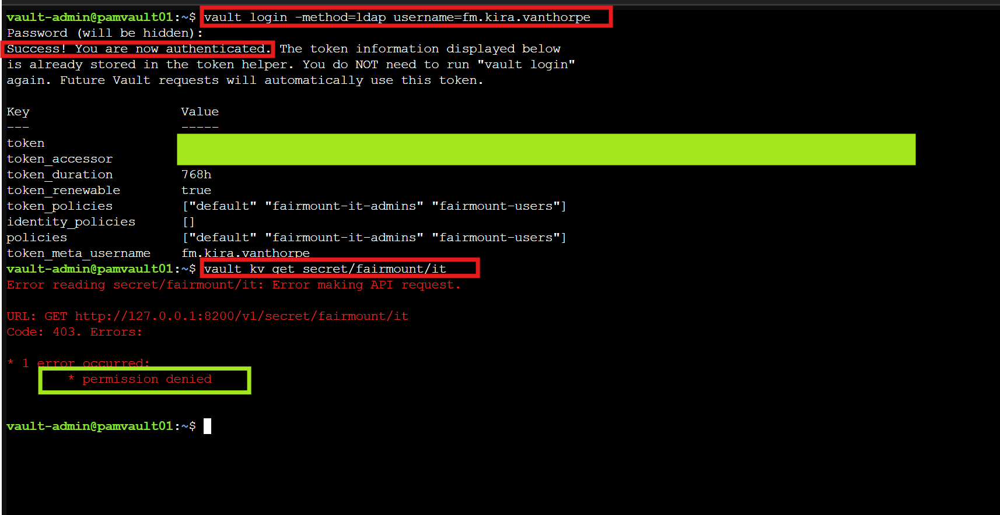

---

## 🟣 Phase 8 — Delinea PAM Setup

Department folders were created in Delinea Secret Server and aligned to the Fairmount structure.

- `Fairmount Manufacturing`
  - `Fairmount Manufacturing/Engineering`
  - `Fairmount Manufacturing/Finance`
  - `Fairmount Manufacturing/IT-Security`

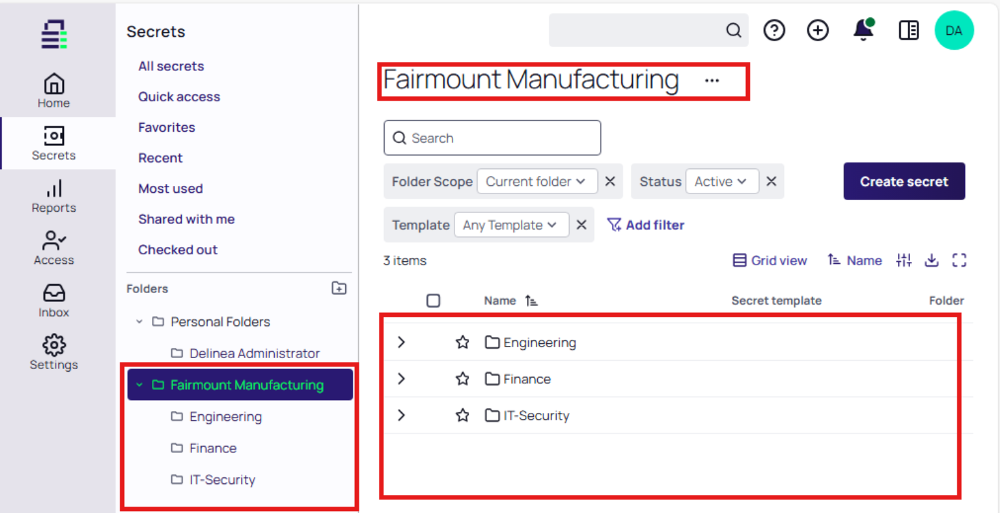

---

## 🟣 Phase 9 — Secret Segmentation in Delinea

Secrets were placed into the correct department folders.

**Engineering folder:**
- Secret Name: `FM Engineering Service Account`
- Username: `svc.eng.fairmount`
- Password: (generate)

**Finance folder:**
- Secret Name: `FM Finance Reporting Account`
- Username: `svc.fin.fairmount`
- Password: (generate)

**IT-Security folder:**
- Secret Name: `FM IT Admin Account`
- Username: `svc.it.fairmount`
- Password: (generate)

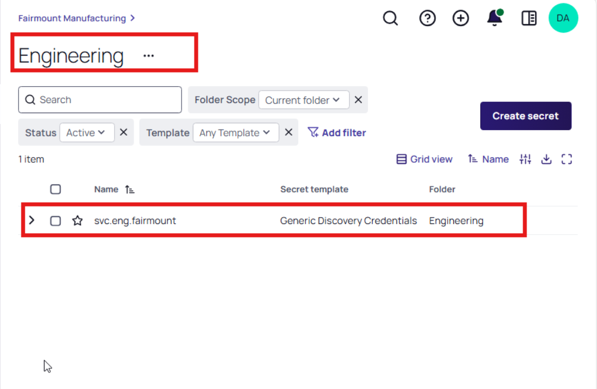
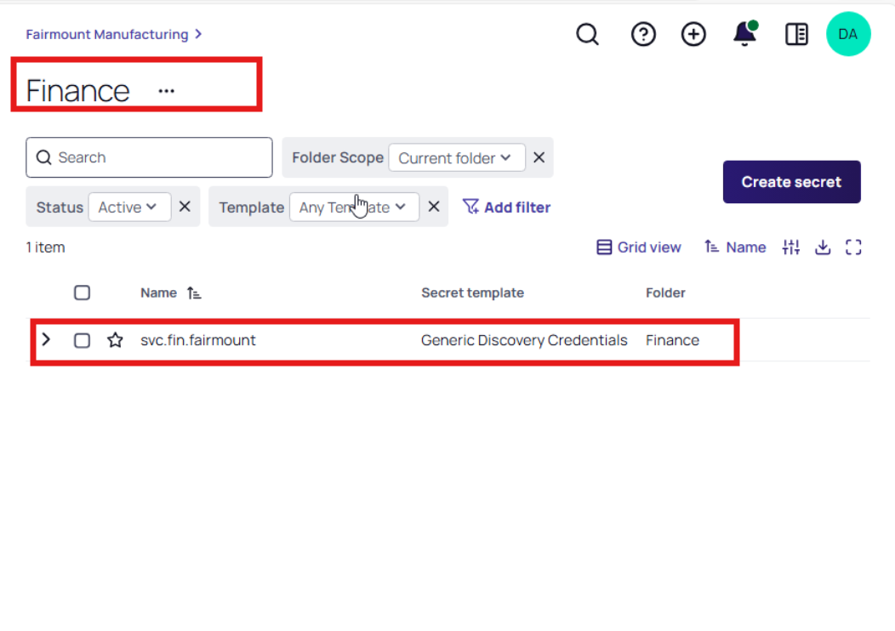
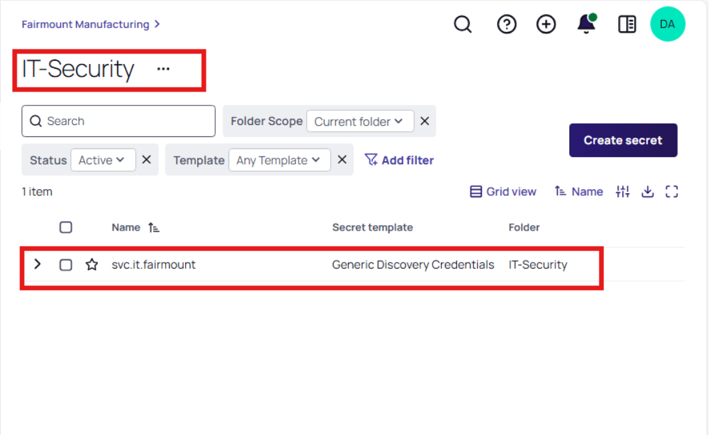

---

## 🟣 Phase 10 — Delinea RBAC Enforcement

Folder-level permissions were assigned using local Delinea groups that mirror the AD structure. Due to Delinea single-user licensing limitations, live multi-user login validation was not possible, but the RBAC design and enforcement were fully implemented.

| Group | Folder | Access Level |
|---|---|---|
| ENG-Users | Engineering | Read |
| FIN-Users | Finance | Read |
| FIN-Approvers | Finance | Read |
| FIN-Auditors | Finance | Read |
| IT-Admins | IT-Security | Owner |
| SEC-Analysts | All Fairmount folders | Read |

Expected access behavior:
- ENG-Users → Engineering only
- FIN-Users → Finance only
- IT-Admins → Elevated access
- SEC-Analysts → Read-only security visibility

**Note:** Due to licensing constraints in the lab environment, direct Active Directory integration within Delinea Secret Server could not be completed at this stage. AD group structure was replicated within Delinea using local groups to maintain architectural accuracy. This approach ensures that once AD integration is enabled, group synchronization can occur without requiring redesign of access controls.

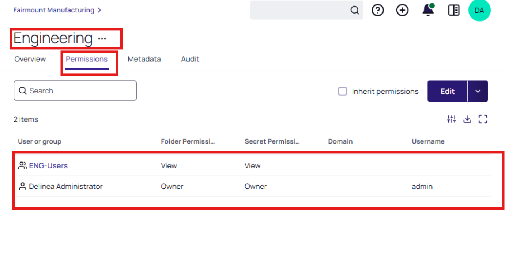
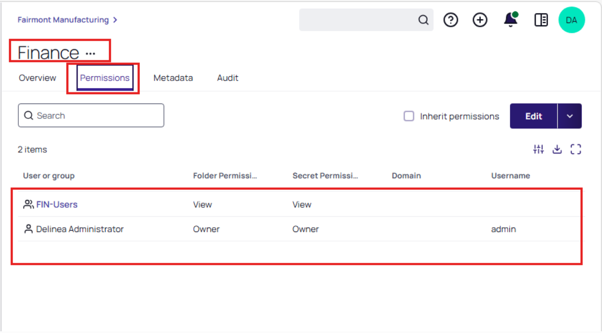
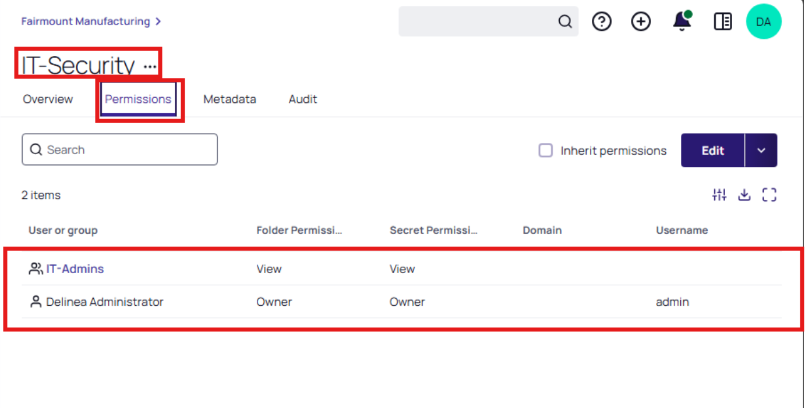

---

## 🟣 Phase 11 — Splunk Audit Validation

Splunk was used to validate both user creation (JOINER lifecycle) and group membership assignment (RBAC enforcement) using Windows Security Event Logs.

### 🔍 User Creation Validation (Event ID 4720)

```spl
index=wineventlog EventCode=4720
| search Account_Name="fm.*"
| table _time, Account_Name, Subject_Account_Name
| sort _time
```

This confirms that all Fairmount users were successfully created in Active Directory by the privileged administrator account.

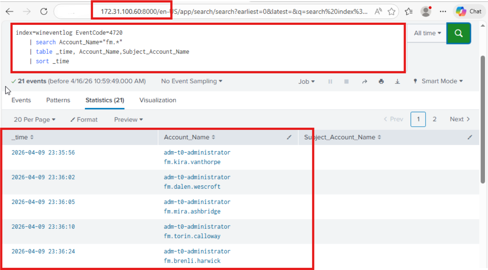

### 🔍 Group Membership Validation (Event ID 4728)

```spl
index=wineventlog EventCode=4728 (Group_Name="ENG-Users" OR Group_Name="FIN-Users" OR Group_Name="FIN-Approvers" OR Group_Name="FIN-Auditors" OR Group_Name="IT-Admins" OR Group_Name="SEC-Analysts" OR Group_Name="AAD-Sync-Users")
| rex field=Message "(?i)Member Name:\s+CN=(?<Added_User>[^,]+)"
| table _time, Group_Name, Added_User, Account_Name
| sort _time
```

This validates that each user was added to the correct RBAC group, including departmental groups and the `AAD-Sync-Users` scoping group used for Entra synchronization. The `Added_User` field is extracted directly from the Windows event message to clearly show which identity was assigned to each group.

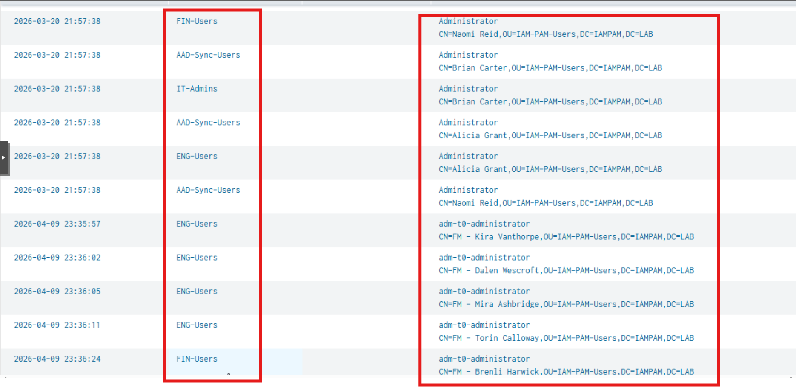

### 🎯 Validation Outcome

All 10 Fairmount users were successfully created and assigned to the correct groups. All actions were performed by the privileged account `adm-t0-administrator`. Splunk visibility confirms that identity lifecycle events are logged, RBAC enforcement is auditable, and the onboarding workflow is traceable end-to-end.

### 🧠 Engineering Note

Windows Event ID 4728 does not expose clean user fields by default. The rex extraction was required to parse the Message field and surface the actual user (Added_User) being added to the group. This reflects real-world SIEM engineering where raw logs must be normalized to produce meaningful, investigation-ready data.

---

## 🟣 Phase 12 — AWS Federation Validation

AWS SAML access was validated for the IT-Admins path after identity provisioning and Entra
synchronization. Validation was performed using `fm.seren.holwick` as the IT-Admins
representative identity.

**Validation performed:**

- AWS SSO User Access URL used to initiate SAML authentication via Entra ID
- `fm.seren.holwick` successfully authenticated through the Entra ID identity plane
- Browser redirected to `profile.aws.amazon.com` confirming AWS accepted the SAML
assertion and recognized the identity as
`fm.seren.holwick@fairmontmanufacturing.onmicrosoft.com`
- AWS initiated account setup for the identity confirming role mapping is enforced
through the identity plane
- Entra ID Sign-in logs confirmed successful interactive authentication for
`fm.seren.holwick` on 4/17/2026

**Note on Splunk visibility:**
AWS SAML federation events are not captured in `index=wineventlog` as this index only
receives Windows Security Event logs from DC01. Capturing AWS SSO sign-in events in
Splunk would require Entra ID Sign-in log forwarding via Azure Monitor and Event Hub —
outside the current lab scope and represents a future logging integration enhancement.

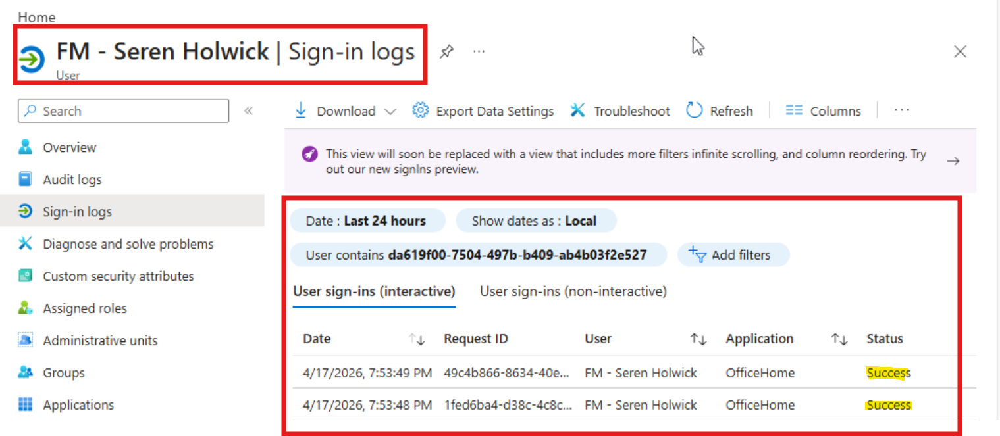
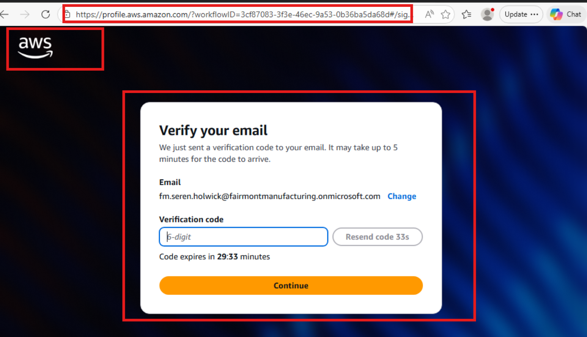

---

## 🔄 Rollback Procedures

### Scenario A — Single User Remediation

Use this when a single user needs targeted remediation or rollback.

```powershell
$SAM = "fm.kira.vanthorpe"
$PrimaryGroup = "ENG-Users"

try {
    Remove-ADGroupMember -Identity "AAD-Sync-Users" -Members $SAM -Confirm:$false -ErrorAction Stop
}
catch {
    Write-Host "Failed removing $SAM from AAD-Sync-Users: $_"
}

try {
    Remove-ADGroupMember -Identity $PrimaryGroup -Members $SAM -Confirm:$false -ErrorAction Stop
}
catch {
    Write-Host "Failed removing $SAM from $PrimaryGroup: $_"
}

try {
    Remove-ADUser -Identity $SAM -Confirm:$false -ErrorAction Stop
    Write-Host "✅ Removed user: $SAM" -ForegroundColor Green
}
catch {
    Write-Host "❌ Failed removing AD user $SAM: $_" -ForegroundColor Red
}

Invoke-Command -ComputerName ID-SYNC01 -ScriptBlock {
    Import-Module ADSync
    Start-ADSyncSyncCycle -PolicyType Delta
}
```

### Scenario B — Full Bulk Rollback

Use this when the entire Fairmount onboarding batch must be reversed.

```powershell
$users = @(
    "fm.kira.vanthorpe",
    "fm.dalen.wescroft",
    "fm.mira.ashbridge",
    "fm.torin.calloway",
    "fm.brenli.harwick",
    "fm.casen.morrow",
    "fm.lyris.dunvale",
    "fm.orin.tressler",
    "fm.seren.holwick",
    "fm.zael.cortbridge"
)

foreach ($user in $users) {
    try {
        Remove-ADGroupMember -Identity "AAD-Sync-Users" -Members $user -Confirm:$false -ErrorAction Stop
    }
    catch {
        Write-Host "Could not remove $user from AAD-Sync-Users: $_"
    }

    try {
        Remove-ADUser -Identity $user -Confirm:$false -ErrorAction Stop
        Write-Host "✅ Removed: $user" -ForegroundColor Green
    }
    catch {
        Write-Host "❌ Could not remove $user — $_ (may not exist)" -ForegroundColor Yellow
    }
}

Invoke-Command -ComputerName ID-SYNC01 -ScriptBlock {
    Import-Module ADSync
    Start-ADSyncSyncCycle -PolicyType Delta
}
```

Optional post-rollback cleanup:
- Remove Vault secrets if onboarding is cancelled:

```bash
vault kv delete secret/fairmount/engineering
vault kv delete secret/fairmount/finance
vault kv delete secret/fairmount/it
```

- Remove Delinea secrets or folders if no longer needed — navigate to each Fairmount folder in Delinea and delete manually.
- Verify Entra accounts are removed after delta sync: navigate to `https://entra.microsoft.com` → Users → All Users and search `fm.` to confirm no accounts remain.

---

## 🔐 RBAC Validation

Because Delinea Secret Server was limited to a single active user under lab licensing, RBAC validation was performed through:

- Group creation
- Folder-to-group permission assignment
- Secret segregation by department
- Expected access path modeling

This preserves architectural correctness while documenting the licensing limitation honestly.

---

## 📊 Validation Checklist

- AD users created ✔
- Users added to departmental groups ✔
- Users added to `AAD-Sync-Users` ✔
- Provisioning results CSV exported ✔
- All users enabled and in correct OU ✔
- Entra delta sync triggered ✔
- Entra users visible ✔
- Entra group membership confirmed ✔
- Vault LDAP configured ✔
- Vault policies created ✔
- Vault group mapping complete ✔
- Vault secrets created ✔
- Unauthorized SSH denied ✔
- Unauthorized Vault secret access denied ✔
- Delinea folders created ✔
- Delinea secrets mapped ✔
- Delinea folder permissions assigned ✔
- Splunk audit queries validated ✔
- AWS federation path validated ✔

---

## 🛡️ CMMC Level 2 Alignment

| Practice | Control | Evidence |
|---|---|---|
| AC.1.001 | Limit system access to authorized users | AD group-based access control |
| AC.2.006 | Use non-privileged accounts | Standard Fairmount users have no admin rights |
| AC.2.007 | Limit privileged account use | IT-Admins only for elevated access |
| IA.3.083 | Use multifactor authentication | Entra ID identity plane and federated controls |
| AU.2.041 | Audit user management actions | Splunk Event ID 4720 and 4728 visibility |
| CM.2.061 | Establish baseline configurations | Vault policies and Delinea RBAC model |

---

## 🧠 Engineering Notes

- `AAD-Sync-Users` is required to control which on-prem identities are synchronized to Entra ID
- The Entra UPN namespace must be routable and aligned to the tenant namespace (`fairmontmanufacturing.onmicrosoft.com`)
- All user creation performed from MGMT01 per PAW model
- `fm.` prefix ensures lab users are clearly distinguishable from existing accounts
- All user names are entirely fictional — no real individuals referenced
- Password set to `Welcome@Fairmount2026!` with forced change at next logon
- Error handling in the creation script ensures partial failures do not go undetected
- Provisioning results are exported to CSV for audit trail — tracks UserCreated, GroupAdded, and SyncScoped
- Vault LDAP binddn must match actual adm-t0-administrator OU path in your environment
- Vault policies scoped to `secret/fairmount/*` to isolate Fairmount secrets
- Delinea folder structure mirrors department hierarchy for clean RBAC
- Standard users are intentionally denied SSH access to privileged Linux systems to validate least privilege
- Privileged service accounts are stored as secrets, not used as interactive user identities
- Delinea licensing imposed a single-user limitation — RBAC enforcement was validated through configuration and design rather than live multi-user testing
- Group-based access control was intentionally mirrored across AD, Vault, and Delinea to keep the architecture consistent
- Entra sync may take 2-5 minutes after delta sync trigger
- Removing AD users does not immediately remove Entra accounts — always re-run delta sync after any rollback

---

## 🏁 Final Outcome

```text
User → Group → AAD-Sync-Users → Entra ID → Vault / Delinea → Controlled Access → Splunk Audit
```

This lab demonstrates a complete JOINER lifecycle implementation with IAM, PAM, audit validation, and cloud identity synchronization.

---

## Next Lab

[Lab 02 — Incident Response: Anomalous Admin Behavior](../lab-02-incident-response/lab-02-incident-response.md)

---

**E.E. Spence — Identity Engineering | IAMPAM.LAB**