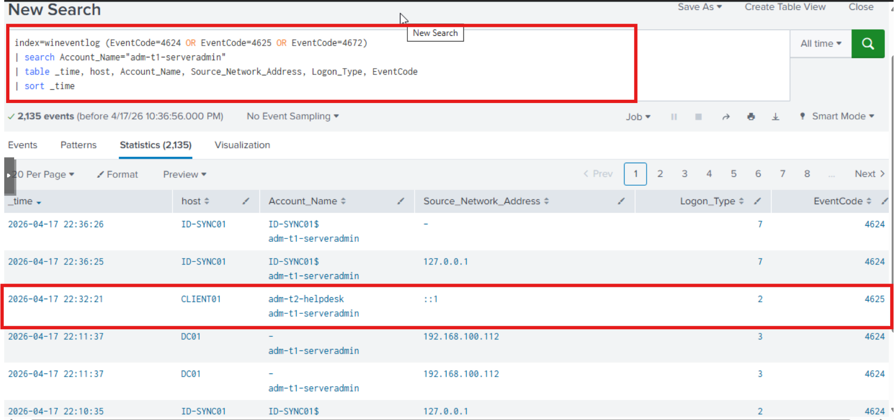
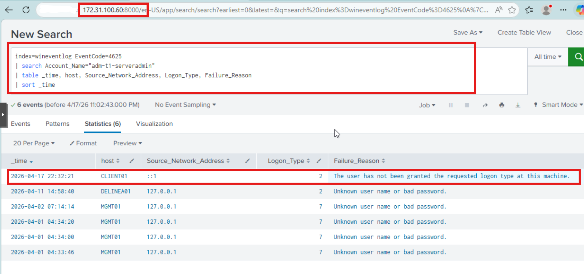
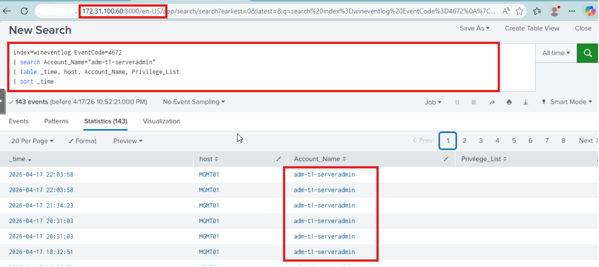
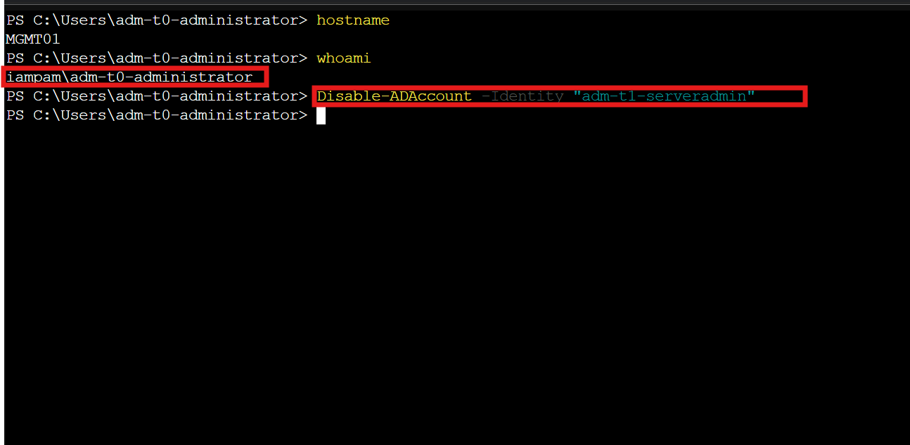
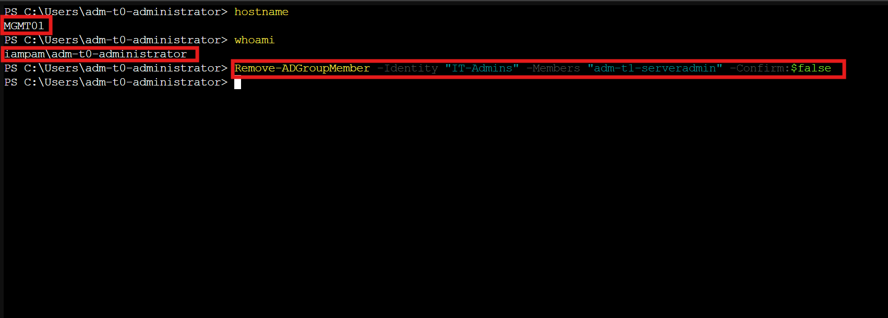
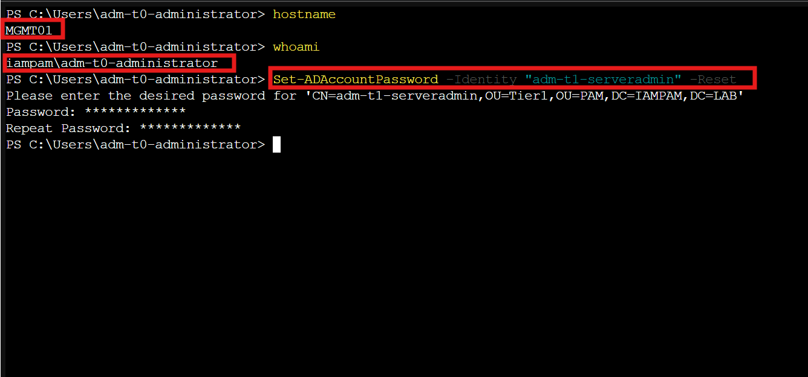
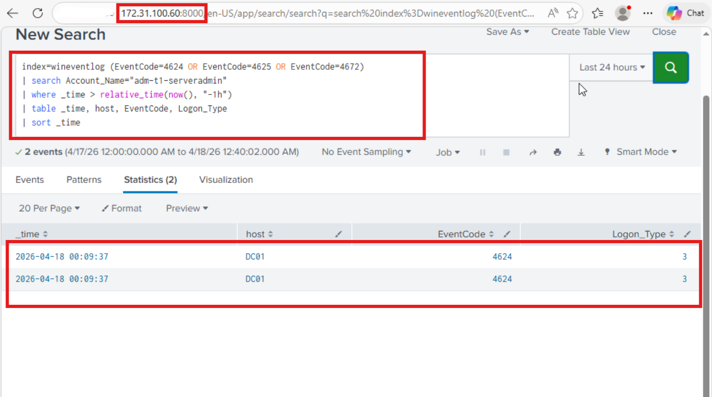

← [Back to Main README](../README.md)


# Lab 02 — Incident Response: Anomalous Admin Behavior

**Author:** Edward E. Spence
**Organization:** Fairmont Manufacturing LLC
**Lab:** IAMPAM.LAB
**Version:** 1.1
**Status:** ✅ Completed

---

## ⚠️ Simulation Notice

This lab simulates a real-world security incident involving anomalous administrative activity within a hybrid identity environment. All identities and events are fictional but executed on real infrastructure.

---

## 🎯 Objective

Detect, investigate, and respond to suspicious privileged account activity using:

* Active Directory logs
* Splunk SIEM
* IAM enforcement controls

---

## 🧠 Scenario Overview

**Ticket:** INC0043102
**Severity:** High
**Type:** Suspicious Privileged Activity

> Splunk detected anomalous login behavior from a privileged account (`adm-t1-serveradmin`), including authentication attempts from unexpected systems and elevated privilege usage.

---

## 🔐 Security Focus

* Privileged account misuse detection
* RBAC validation under incident conditions
* SIEM-driven investigation workflow
* IAM/PAM response enforcement
* Full audit traceability

---

## 🏗️ Architectural Design Note — Privileged Accounts and Entra ID

> **By design, privileged tier accounts (Tier 0, Tier 1, Tier 2) in this environment are intentionally excluded from Microsoft Entra ID synchronization.**

This is a deliberate security architecture decision aligned with Microsoft's Enterprise Access Model and PAM best practices:

- **Tier 0** accounts (`adm-t0-*`) — Domain and identity plane administrators. Exist only in on-premises Active Directory. Never synchronized to Entra ID.
- **Tier 1** accounts (`adm-t1-*`) — Server and workload administrators. Exist only in on-premises Active Directory. Never synchronized to Entra ID.
- **Tier 2** accounts (`adm-t2-*`) — Workstation administrators. Exist only in on-premises Active Directory. Never synchronized to Entra ID.

Synchronizing privileged accounts to Entra ID would expose them to cloud-based attack surfaces including token theft, OAuth abuse, and identity plane compromise. Keeping privileged accounts strictly on-premises enforces:

- Hard boundary between cloud and privileged identity planes
- Elimination of cloud-based lateral movement paths for privileged identities
- Compliance with least privilege and separation of duties principles

**This means containment actions for privileged accounts (disable, group removal, credential reset) are performed entirely within Active Directory and do not require Entra ID synchronization.** The on-premises AD remains the authoritative identity source for all privileged tiers.

---

## 🟣 Phase 1 — Detection

### Step 01 — Identify Suspicious Logins

```spl
index=wineventlog (EventCode=4624 OR EventCode=4625 OR EventCode=4672)
| search Account_Name="adm-t1-serveradmin"
| table _time, host, Account_Name,Source_Network_Address, Logon_Type, EventCode
| sort _time
```



---

## 🟣 Phase 2 — Investigation

### Step 02 — Identify Source of Login

```spl
index=wineventlog EventCode=4625
| search Account_Name="adm-t1-serveradmin"
| table _time, host, Source_Network_Address, Logon_Type, Failure_Reason
| sort _time
```

Findings:

* Failed logons originated from **CLIENT01**
* Unauthorized logon attempt confirmed



---

### Step 03 — Privilege Escalation Activity

```spl
index=wineventlog EventCode=4672
| search Account_Name="adm-t1-serveradmin"
| table _time, host,Account_Name, Privilege_List
| sort _time
```

Findings:

* Privileged logon events observed
* Account confirmed to have elevated access



---

## 🟣 Phase 3 — Containment

### Step 04 — Disable Compromised Account

```powershell
Disable-ADAccount -Identity "adm-t1-serveradmin"
```

Verify the account is disabled:

```powershell
Get-ADUser -Identity "adm-t1-serveradmin" -Properties Enabled |
Select-Object Name, SamAccountName, Enabled
```

Expected: `Enabled = False`



---

### Step 05 — Remove Privileged Group Membership

```powershell
Remove-ADGroupMember -Identity "IT-Admins" -Members "adm-t1-serveradmin" -Confirm:$false
```

Verify removal:

```powershell
Get-ADGroupMember -Identity "IT-Admins" |
Where-Object { $_.SamAccountName -eq "adm-t1-serveradmin" }
```

Expected: No results returned — confirming removal.



---

### Step 06 — Reset Credentials

```powershell
Set-ADAccountPassword -Identity "adm-t1-serveradmin" `
    -NewPassword (ConvertTo-SecureString "Incident@Reset2026!" -AsPlainText -Force) `
    -Reset

Set-ADUser -Identity "adm-t1-serveradmin" -ChangePasswordAtLogon $true
```



---

## 🟣 Phase 4 — Validation

### Step 07 — Post-Containment Validation

```spl
index=wineventlog (EventCode=4624 OR EventCode=4625 OR EventCode=4672)
| search Account_Name="adm-t1-serveradmin"
| where _time > relative_time(now(), "-1h")
| table _time, host, EventCode, Logon_Type
| sort _time
```



---

## 🧠 Engineering Note — Controlled Policy Adjustment

During incident response simulation, a temporary modification was applied to the Group Policy Object **"GPO-Tier1-Logon-Restrictions"** to allow interactive logon for members of **PAM-Tier0-Admins** on MGMT01.

This adjustment was required to perform containment and validation tasks directly on the system.

By default:

* Tier 0 accounts are restricted from Tier 1 systems
* Enforced via **Deny log on locally**

This lab temporarily simulated a:

> **Break-glass administrative access scenario**

After validation, this control should be restored to maintain proper tier isolation.

---

## 🎯 Validation Outcome

Post-containment validation confirmed:

* No new privileged logon events (**Event ID 4672**)
* Successful logons (**Event ID 4624**) were limited to:
  * **DC01**
  * **Logon Type 3 (Network)**

These events are consistent with background authentication processes, not interactive or administrative sessions.

This confirms:

* Privileged access was effectively removed
* No lateral movement occurred post-containment
* RBAC enforcement was successful
* All containment actions performed entirely within Active Directory — no Entra ID sync required as privileged tier accounts are intentionally excluded from cloud synchronization by design

---

## 🛡️ MITRE ATT&CK Alignment

| Technique | Description |
| --------- | ----------- |
| T1078 | Valid Accounts |
| T1550 | Use of Alternate Authentication Material |
| T1021 | Remote Services |

---

## 🛡️ CMMC Level 2 Alignment

| Practice | Control | Evidence |
|---|---|---|
| AU.2.041 | Audit user management actions | Splunk Event ID 4624, 4625, 4672 visibility |
| AU.2.042 | Review and analyze audit logs | Splunk SPL investigation queries |
| IR.2.092 | Establish incident handling capability | Structured detection, investigation, containment, validation workflow |
| IR.2.093 | Track and document incidents | INC0043102 ticket with full audit trail |
| AC.2.007 | Limit privileged account use | adm-t1-serveradmin removed from IT-Admins |
| IA.3.083 | Use multifactor authentication | Entra ID identity plane enforced for standard user identities |

---

## 📊 Validation Checklist

- Suspicious login detected ✔
- Source identified ✔
- Privilege escalation analyzed ✔
- Account disabled ✔
- Group membership removed ✔
- Credentials reset ✔
- Post-containment validation confirmed ✔

---

## 🧠 Key Takeaways

* SIEM visibility enables rapid detection of identity threats
* Privileged accounts require continuous monitoring
* RBAC enforcement reduces blast radius
* Group Policy controls enforce tier boundaries
* Incident response must include a validation phase
* Privileged tier accounts are intentionally excluded from Entra ID synchronization — containment is performed entirely within on-premises Active Directory by design
* Break-glass scenarios must be controlled and documented

---

## 🏁 Final Flow

```text
Detection → Investigation → Containment → Validation → Audit
```

---

## Ticket Resolution

**Ticket:** INC0043102
**Status:** Resolved
**Resolution:** Anomalous privileged account activity detected for `adm-t1-serveradmin` via Splunk SIEM. Investigation confirmed unauthorized login attempts originating from CLIENT01 with elevated privilege usage. Account was disabled, removed from IT-Admins group, and credentials were reset within Active Directory. No Entra ID synchronization was required as privileged tier accounts are intentionally excluded from cloud identity synchronization per enterprise PAM architecture. Post-containment validation confirmed no further privileged logon events. RBAC enforcement verified. No lateral movement detected. Incident fully contained and documented.

---

## 📁 Required Folder Structure

```text
lab-02-incident-response/
├── lab-02-incident-response.md
└── screenshots/
    ├── lab02_01_suspicious_logins.png
    ├── lab02_02_login_source.png
    ├── lab02_03_privilege_escalation.png
    ├── lab02_04_account_disabled.png
    ├── lab02_05_group_removal.png
    ├── lab02_06_password_reset.png
    ├── lab02_07_post_containment.png
```

---

## Next Lab

[Back to Main README](../README.md)

---

**E.E. Spence — Identity Engineering | IAMPAM.LAB**